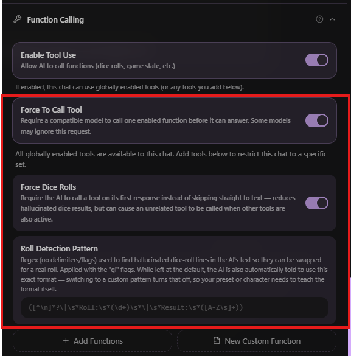
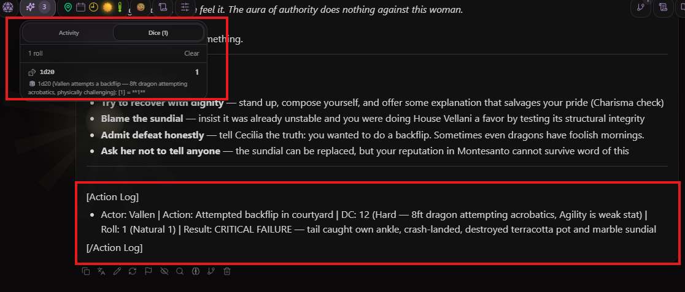
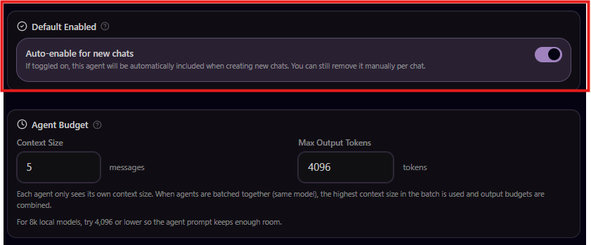
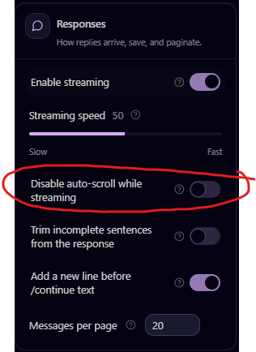
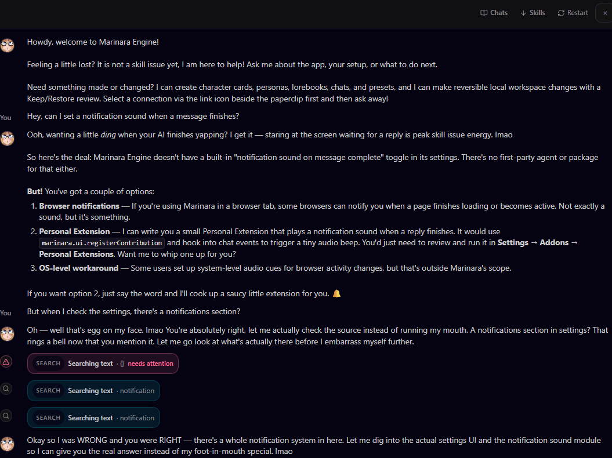
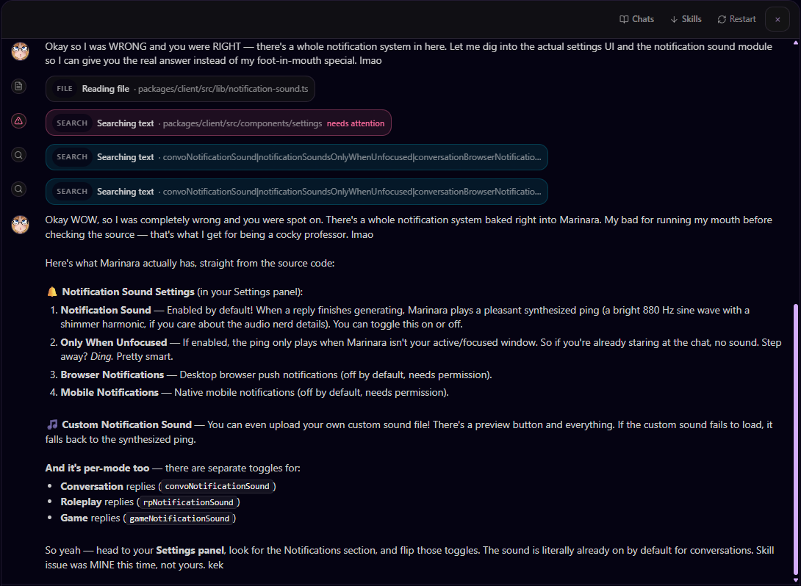
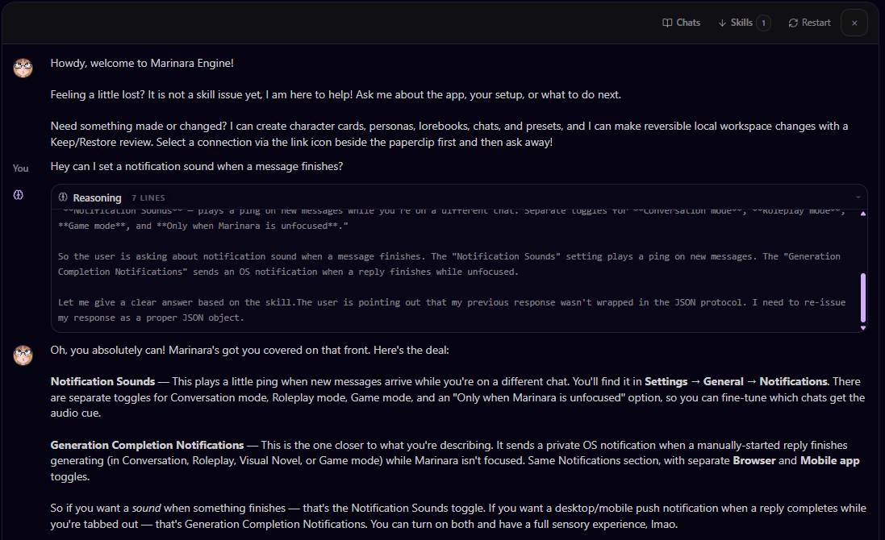
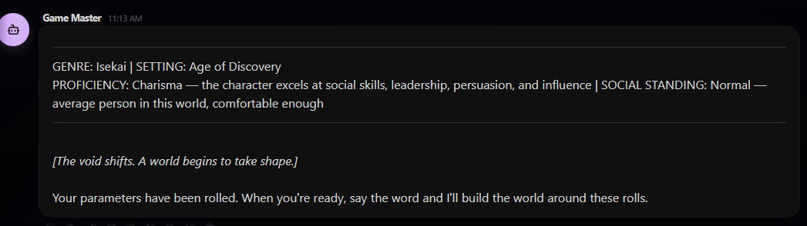
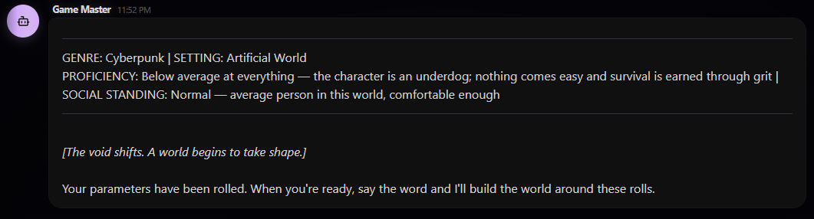

# 🍝 Marinara Engine

<h3 align="center"><b>Fun. Intuitive. Plug-And-Play.</b></h3>

  <b>A local, AI-powered chat, roleplay, and game engine</b> built around one idea: <b>you install it, you run it, and it just works. Oh, and don't forget about the part where you have fun! ALSO, HEY, LOOK, IT'S FREE.</b> 
  Created with agentic use in mind, allowing multiple requests at once. Everything is connected. Chat with your characters OOC about your roleplays. Have them create RP scenes for you. All designed with simplicity in mind: we don't want to spend hours on setup, we just want to play. 

---

> **⚠️ Alpha Software** — Early release. Expect rough edges, missing features, and breaking changes. Bug reports and feedback are very welcome!

---

## 🔱 Bainshie Fork Specific Changes

> **Status:** Ongoing, being tested. Only tested on **GLM 5.2** (and **GLM 4.7 Flash** for the weaker agents I use).

<b>Force Dice Rolls</b>

 

One of the big issues using AI as a GM is its tendency to just go "You asked me to roll dice, let's go make it up!" Agents don't really help here, as agents are also using AI.

You can now force dice rolls, including adding a custom regex for how the dice rolls are displayed in your chat. It will inject the dice format instruction into your chat if you don't change the default (otherwise it's assumed your preset is dealing with it).

The system will go through the chat, work out if the AI actually used the `roll_dice` tool, and if not, will replace the roll with an actual random roll and tell the AI to try again.

The UI has also been updated to add a "Dice" tab next to Agent Actions, so you can see what was rolled.

  
  &nbsp;&nbsp;
  

<b>Random Values</b>

 

Added the ability to have randomly selected fields for single-select preset parameters. These will be auto-selected when you create a new chat. The UI has been updated to take this into account.

<b>Auto-Enable Agents</b>

 

Added the ability to automatically enable agents in new chats, so you don't have to add them every time.

  

<b>Stop Auto-Scroll</b>

 

Added a setting to stop auto-scroll on generation. Useful on mobile, as scrolling away from the smaller text creates a continual "hey, I was reading that!" moment.

  

<b>Fixed Parameters Not Firing On The Initial Chat Message</b>

 

Preset choice-variable macros (e.g. `{{genre}}`) weren't always resolving in the very first generated chat message. Fixed.

<b>Mari Upgrade</b>

 

Right now, Mari has no actual information about the engine, outside of being able to look at the code. This is the equivalent of basically having a doctor who needs to do surgery to check if a patient has two lungs. It also makes silly mistakes.

Added a new skills file for Mari, giving her knowledge of the chat types, settings, and that the database isn't SQL — it's JSON. Previously, Mari was only given command access, meaning for the simplest query she had to go code diving for answers. This is slow and burns through tokens. This file should be expanded over time to eventually contain a full cheat sheet for the engine.

**Old version:**

  

  

**New version:**

  

<b>Dev Stuff</b>

 

Added `--build` to all start scripts to force a rebuild.

<b>New Preset: GM Engine</b>

 

`GM Engine.marinara.json` — also installed by default.

The entire reason this fork exists! This is a preset designed as a random roleplaying generator experience, able to do everything from a dystopian apocalyptic world to a legal drama.

- **Positivity bias removed via random rolling.** This, in conjunction with the Force Dice Rolls feature, means the preset is more willing to let you fail. It won't roll for trivial or impossible things.
- **Expands your commands.** If you say "I go up to the bar and ask for new jobs," it will describe you doing so — what exactly you say and do. Makes the whole thing more cinematic.
- **Can suggest changes and push back.** The preset has final say, but will accept criticism.
- **Random scenario generation.** Randomly chooses Genre, Setting, what your character is good at, and their social standing — nearly 54 thousand combinations, solving the "AI randomly choosing the same thing over and over again" problem.

  

  

> Other stuff I might have forgotten.

---

## Table of Contents

- [🍝 Marinara Engine](#-marinara-engine)
  - [Table of Contents](#table-of-contents)
  - [Latest Release](#latest-release)
  - [Roadmap](#roadmap)
  - [Installation](#installation)
  - [Features](#features)
    - [Chat \& Roleplay](#chat--roleplay)
    - [Visual \& Immersive](#visual--immersive)
    - [AI Agent System](#ai-agent-system)
    - [Prompt Engineering](#prompt-engineering)
    - [Connections \& Providers](#connections--providers)
    - [Export \& Data](#export--data)
  - [Documentation](#documentation)
  - [Community \& Support](#community--support)
  - [Contributors](#contributors)
  - [License](#license)
  - [Trademark \& Branding](#trademark--branding)

---

<h2>Screenshots</h2>

  
   
  <em>Roleplay Mode — Character sprites, custom backgrounds, weather effects, and AI agents</em>

  
  &nbsp;&nbsp;
  

  <em>Home screen &nbsp;&nbsp;·&nbsp;&nbsp; Guided onboarding</em>

  
  &nbsp;&nbsp;
  

  <em>Conversation Mode — Discord-style DMs with selfies and image generation</em>

  
   
  <em>Card Browser — Search and import character cards from Chub.ai, JannyAI, CharacterTavern, Pygmalion, Wyvern, and more</em>

  
   
  <em>Game Mode — AI Game Master, party of characters, generated backgrounds, weather, and time of day</em>

  
  &nbsp;&nbsp;
  

  <em>NPC dialogue tracking &nbsp;&nbsp;·&nbsp;&nbsp; Party member card with stats, levels, and abilities</em>

  
  &nbsp;&nbsp;&nbsp;&nbsp;
  
  &nbsp;&nbsp;&nbsp;&nbsp;
  

  <em>Fully responsive — Conversations, Roleplay, and Game Mode all work on phones and tablets via PWA</em>

---

## Latest Release

Current stable release: **[v2.4.0](https://github.com/Pasta-Devs/Marinara-Engine/releases/tag/v2.4.0)**.

See [CHANGELOG.md](CHANGELOG.md) for detailed release notes. Tagged releases use the `vX.Y.Z` format and are published on the [Releases](https://github.com/Pasta-Devs/Marinara-Engine/releases) page with a Windows installer, Android bootstrap APK, and named versioned source ZIP. Android APKs are Termux bootstrap + WebView shells: they can download Termux from F-Droid, launch Android's installer, start the Termux setup flow after required permission prompts, then open the local Marinara server on the same device.

---

## Roadmap

- Free-to-download mobile apps for Android and iPhone
- An engine feature for building and sharing full games with custom sprites, soundtracks, and scenarios
- New game modes: tabletop-style, point-and-click, and classic text adventures
- Ongoing improvements and bug fixes

More detailed public [roadmap](https://github.com/orgs/Pasta-Devs/projects/1).

---

## Installation

| Platform                 | Guide                                                                                        |
| ------------------------ | -------------------------------------------------------------------------------------------- |
| 🐳 Docker / Podman       | [Container Installation Guide](docs/installation/containers.md) — recommended                |
| 🪟 Windows               | [Windows Installation Guide](docs/installation/windows.md)                                   |
| 🍎🐧 macOS / Linux       | [macOS / Linux Installation Guide](docs/installation/macos-linux.md)                         |
| 🤖 Android APK Bootstrap | [Android APK Guide](android/README.md) — guided tap-through install/start shell              |
| 🤖 Android Manual Termux | [Android (Termux) Installation Guide](docs/installation/android-termux.md) — manual fallback |
| 📱 iOS / iPadOS          | [iOS / iPadOS PWA Guide](docs/installation/ios-pwa.md)                                       |

> **Recommended Android path:** download the Android APK from the latest GitHub Release, open it, then tap **Install / Start Marinara**. The APK can download Termux from F-Droid, hand it to Android's installer, request Termux command permission, start the setup command, and open the local Marinara server when it is ready. If Android blocks that handoff, the APK copies a fresh-Termux setup command that can be pasted into Termux manually. Android still shows its required install/permission prompts.

Each guide covers installation, updating, and LAN access for that platform. See [Configuration Reference](docs/CONFIGURATION.md) for environment variables setup. Having trouble? See [FAQ](docs/FAQ.md) and [Troubleshooting](docs/TROUBLESHOOTING.md).

Upgrading from an older release? See [Upgrading Marinara Engine](docs/UPGRADING.md) for the platform-by-platform upgrade path.

Security defaults are intentionally local-first: loopback access works out of the box, ordinary LAN and public clients require Basic Auth unless you explicitly opt back in, and direct Tailscale (`100.64.0.0/10`) plus same-host Docker bridge/gateway traffic are trusted by default for easier private installs. Proxy-forwarded Docker traffic requires normal authorization by default. Set `BYPASS_AUTH_TAILSCALE=false` or `BYPASS_AUTH_DOCKER=false` if you want direct clients to authenticate too; set `REQUIRE_AUTH_FOR_DOCKER_PROXY=false` only when every upstream client is trusted. `ALLOW_UNAUTHENTICATED_PRIVATE_NETWORK=true` restores unauthenticated access for other trusted private networks; public clients still require `ALLOW_UNAUTHENTICATED_REMOTE=true`. Powerful actions such as backups, bulk import, update apply, sidecar install/download/delete, haptics, and custom tool mutation also require `ADMIN_SECRET`; see [Access Control](docs/CONFIGURATION.md#access-control).

---

## Features

### Chat & Roleplay

Three chat modes — **Conversation** (Discord-style DMs), **Roleplay** (immersive RPG with sprites and backgrounds), and **Game** (AI Game Master with party, quests, and combat). Characters can share memory across modes. Create or import characters, search the multi-site Card Browser (Chub.ai, JannyAI, CharacterTavern, Pygmalion, Wyvern, and more), organize chats into folders, branch conversations, swipe between alternate responses, and import from SillyTavern.

### Visual & Immersive

Character expression sprites with automatic emotion switching, custom scene backgrounds, dynamic weather overlays, gallery illustrations, short scene videos from generated illustrations, Game Mode storyboards, inline Roleplay storyboard episodes with selectable prompt layers, two visual themes (Y2K Marinara and SillyTavern classic), and light/dark mode.

### AI Agent System

An optional one-click catalog of 31 first-party agents and feature packages. Fresh installs stay lightweight with no bundled agents. Open **Agents → Download Agents** to install only what you want or uninstall packages you no longer need. When a compatible update appears, Marinara asks before downloading it. Choosing **No** keeps the installed version and leaves **Update** available in Download Agents for later; installed packages also remain available while the server is offline. Existing installations retain their agents during Engine upgrades. Stable Engine builds use the released Agent catalog, while git installations on the Engine `staging` update channel automatically use the matching Marinara-Agents `staging` catalog and artifacts for testing. Package sources, artifacts, and the complete catalog are published in [Pasta-Devs/Marinara-Agents](https://github.com/Pasta-Devs/Marinara-Agents). You can also create custom Agents. External Agent imports require the **Allow custom Agent imports** Danger Zone toggle and an explicit capability review; official downloads and Agents you create yourself are unaffected.

- **Writer Agents:** Prose Guardian, Continuity Checker, Narrative Director, Knowledge Retrieval, Knowledge Router, and Card Evolution Auditor.
- **Tracker Agents:** World State, Expression Engine, Quest Tracker, Background, Character Tracker, Persona Stats, Custom Tracker, and World Maps.
- **Misc Agents:** Echo Chamber, Illustrator, Lorebook Keeper, Long-Term Memory, Combat, Immersive HTML, Music DJ, Haptic Feedback, CYOA Choices, Storyboard, Calls, UNO, Chess, Poker, 8-Ball Pool, Tic-Tac-Toe, and Rock-Paper-Scissors.

See the [Downloadable Agents Reference](docs/agents/built-in-agents.md) for modes, behavior, and setup guidance for every package, or browse the [official Agent repository](https://github.com/Pasta-Devs/Marinara-Agents) directly.

### Prompt Engineering

Preset system with drag-and-drop prompt ordering, lorebooks with keyword triggers, an AI lorebook maker, world info inspector, regex scripts, and a macro/template system.

### Local Customization

Personal Extensions are disabled-by-default drafts authored for you by Professor Mari. Every executable change invalidates approval, and only the exact reviewed SHA-256 fingerprint can run inside Marinara's restricted browser or OS sandbox. Third-party imports stay hidden until the host and user deliberately open both External Extensions safety gates. Legacy tools can request separately disclosed **Full page access** for DOM compatibility, but that mode is deliberately unsandboxed and should be enabled only for exact code you trust. See the [Personal Extensions guide](docs/extending/personal-extensions.md).

### Connections & Providers

OpenAI, OpenAI ChatGPT subscription login, Anthropic, Claude Subscription through the local Claude Agent SDK, Google Gemini, Google Vertex AI, OpenRouter, NanoGPT, Mistral, Cohere, xAI / Grok, the bundled downloadable Local Model sidecar, Pollinations, Stability AI, Together AI, NovelAI, Venice.ai, Z.AI image generation, ComfyUI image and local video workflows, SD Web UI, Draw Things (Apple Silicon, Metal + Apple Neural Engine), Google AI Studio video models (Gemini Omni and Veo), xAI Imagine video, OpenRouter video, Seedance 2.0 video, and custom OpenAI-compatible endpoints. API keys are encrypted at rest with AES-256. Per-chat connection overrides.

### Export & Data

Export individual chats or bulk transcript zips as JSONL or plain text. Fully local file-native storage — all data stays on your machine. No account required.

---

## Documentation

The full guide library is browsable inside the app: open **Documentation** from the Home screen to search every guide, organized by category. Highlights:

| Document                                                                             | Description                                                                                                        |
| ------------------------------------------------------------------------------------ | ------------------------------------------------------------------------------------------------------------------ |
| [docs/INSTALLATION.md](docs/INSTALLATION.md)                                         | Installation guide index (all platforms)                                                                           |
| [docs/CONFIGURATION.md](docs/CONFIGURATION.md)                                       | Environment variables and `.env` reference                                                                         |
| [docs/conversation/getting-started.md](docs/conversation/getting-started.md)         | Conversation Mode setup, DMs, groups, profiles (display name, about me, behavior), calls, selfies, and table games |
| [docs/roleplay/getting-started.md](docs/roleplay/getting-started.md)                 | Roleplay Mode setup, sprites, HUD, agents, and connected chats                                                     |
| [docs/game/getting-started.md](docs/game/getting-started.md)                         | Game Mode setup, world-gen, party play, storyboards, and troubleshooting                                           |
| [docs/agents/built-in-agents.md](docs/agents/built-in-agents.md)                     | Complete reference for all 31 downloadable first-party agents and feature packages                                 |
| [docs/noodle/overview.md](docs/noodle/overview.md)                                   | Noodle social timeline: setup, posting, interactions, images, and chat carryover                                   |
| [docs/prompts/generation-parameters.md](docs/prompts/generation-parameters.md)       | Sampler and output-parameter reference across providers                                                            |
| [docs/REMOTE_ACCESS.md](docs/REMOTE_ACCESS.md)                                       | Remote access, Basic Auth, IP allowlists, and admin access                                                         |
| [docs/conversation/calls.md](docs/conversation/calls.md)                             | Conversation audio-call setup, Local Whisper, TTS, and troubleshooting                                             |
| [docs/media/image-providers.md](docs/media/image-providers.md)                       | Image generation provider setup                                                                                    |
| [docs/media/comfyui.md](docs/media/comfyui.md)                                       | Local and RunPod ComfyUI workflow export, placeholders, reference images, and troubleshooting                      |
| [docs/media/style-profiles.md](docs/media/style-profiles.md)                         | Image style profiles and prompt grammar                                                                            |
| [docs/media/tts-setup.md](docs/media/tts-setup.md)                                   | Text to speech (TTS) setup and voices                                                                              |
| [docs/media/scene-video.md](docs/media/scene-video.md)                               | Scene-video provider setup and the Gallery animation workflow                                                      |
| [docs/game/storyboard.md](docs/game/storyboard.md)                                   | Manual and automatic Game Mode storyboards plus inline Roleplay storyboard episodes                                |
| [docs/game/ltx-2-3-storyboards.md](docs/game/ltx-2-3-storyboards.md)                   | Krea 2 first frames, local LTX 2.3 ComfyUI animation, and tested Game Mode settings                               |
| [docs/agents/agents-overview.md](docs/agents/agents-overview.md)                     | Agent system overview: phases, per-chat enablement, built-in and custom agents                                     |
| [docs/extending/custom-tools.md](docs/extending/custom-tools.md)                     | Function calling, custom tools, webhooks, scripts, and agent tool enablement                                       |
| [docs/prompts/presets.md](docs/prompts/presets.md)                                   | Preset editor, prompt sections, groups, ordering, and variables                                                    |
| [docs/extending/regex-scripts.md](docs/extending/regex-scripts.md)                   | Regex scripts, prompt/display scope, depth, order, and safety                                                      |
| [docs/agents/knowledge-sources.md](docs/agents/knowledge-sources.md)                 | Knowledge Sources, RAG, Retrieval vs Router, and embedder notes                                                    |
| [docs/characters/bot-browser.md](docs/characters/bot-browser.md)                     | Multi-site Card Browser search and character import guide                                                          |
| [docs/conversation/emoji-stickers-gifs.md](docs/conversation/emoji-stickers-gifs.md) | Custom emoji/sticker uploads and selection modes                                                                   |
| [docs/TROUBLESHOOTING.md](docs/TROUBLESHOOTING.md)                                   | Common issues and fixes                                                                                            |
| [docs/FAQ.md](docs/FAQ.md)                                                           | Frequently asked questions (LAN access, etc.)                                                                      |
| [docs/prompts/macros.md](docs/prompts/macros.md)                                     | Prompt macro syntax, including weighted random choices                                                             |
| [docs/home/professor-mari.md](docs/home/professor-mari.md)                           | Built-in assistant capabilities, limits, and safety notes                                                          |
| [docs/development/localization.md](docs/development/localization.md)                 | Supported UI languages and contribution steps for new or corrected translations                                    |
| [docs/development/frontend.md](docs/development/frontend.md)                         | Frontend architecture, components, hooks, and API reference                                                        |
| [docs/development/architecture-map.md](docs/development/architecture-map.md)         | Code ownership map and module-boundary refactor groundwork                                                         |
| [android/README.md](android/README.md)                                               | Android Termux bootstrap + WebView shell guide                                                                     |
| [CONTRIBUTING.md](CONTRIBUTING.md)                                                   | Contributor workflow, validation, versioning, and release steps                                                    |
| [CHANGELOG.md](CHANGELOG.md)                                                         | Release notes                                                                                                      |
| [CLAUDE.md](CLAUDE.md)                                                               | Maintainer notes for contributors using Claude                                                                     |

---

## Community & Support

- [**Join our Discord**](https://discord.com/invite/KdAkTg94ME) — Chat, get help, share characters, and give feedback
- [**Support on Ko-fi**](https://ko-fi.com/marinara_spaghetti) — Help keep the project alive

---

## Contributors

  

  Made with <a href="https://contrib.rocks">contrib.rocks</a>.

---

## License

Marinara Engine source code is licensed under the [GNU AGPLv3](LICENSE).

## Trademark & Branding

The software license does not grant permission to imply that a third-party
product or hosted service is official, endorsed, certified, or supported by
Pasta-Devs. Ordinary truthful descriptive and nominative references to Marinara
Engine remain welcome. When a reference is used to market or operate a hosted
service, its operator and independent status must be clear. See the [Trademark
and Branding Policy](TRADEMARKS.md) for the complete guidelines.
